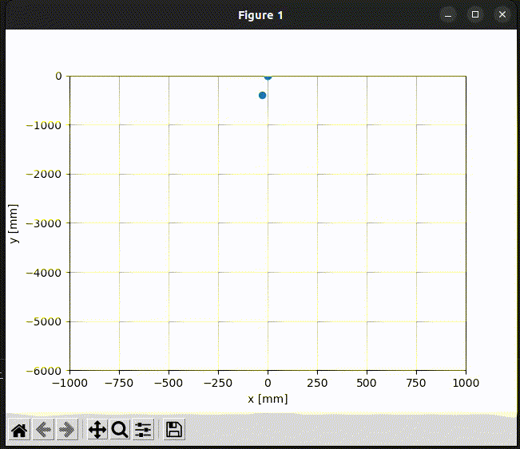

# HLK-LD2450
This is a simple Python implementation of the serial protocol and two demos of the HLK-LD2450 24 GHz Radar Sensor (http://www.hlktech.net/index.php?id=1182). You can also try the app from HLK or the official PC demo. This code uses the serial port to communicate with the sensor.

## Prerequisites
You need the following hardware to run this demo:
- Linux PC (tested with Ubuntu 22.04)
- HLK-LD2450 24 GHz Radar Sensor
- USB to TTL Adapter
- 1.5 mm 4-pin cable

Connect the sensor to the USB to TTL adapter:
- GND to GND
- 5V to 5V
- RX to TX
- TX to RX

Install the required packages:
```bash
pip3 install -r  requirements.txt
```

## Get started
*print_targets.py* prints out the received data from the sensor (x, y, speed, distance resolution) of three targets:
```bash
python3 print_targets.py
```


*plot_targets.py* plots the received data from the sensor (x, y) of three targets:
```bash
python3 plot_targets.py
```



## Troubleshooting
- Check that the USB to TTL adapter is connected to the correct port:
```bash
dmesg | grep tty
```

## Notes and Disclaimer
- There seems to be some outliers in the data which are not filtered in this implementation
